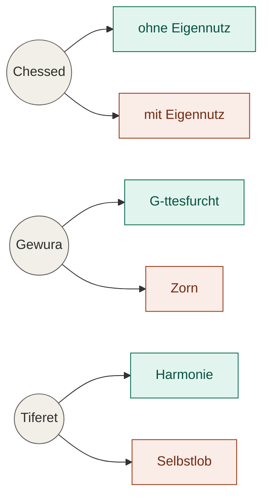

*Zu diesem Beitrag: [Tanja, Kapitel 6](https://de.chabad.org/library/article_cdo/aid/583092/jewish/Kapitel-6.htm)*

---

Der sechste Abschnitt der Tanja ist kurz. Aber er tut etwas Ungewöhnliches: Er beschreibt das Böse nicht als Abwesenheit des Guten, sondern als sein Spiegelbild. G-tt, schreibt der Alter Rebbe, erschuf die Strukturen der Heiligkeit — und schuf daneben, Punkt für Punkt, eine Gegenwelt. Zehn Sefirot hier. Zehn Kronen der Unreinheit dort. Dieselbe Architektur. Entgegengesetzte Ausrichtung.

Das ist der Kontrast, den Kapitel 6 beschreibt — und er zieht sich bis in den Alltag.

Das ist kein Trost. Aber es ist eine Erklärung.

G-tt schuf das eine gegenüber dem anderen.

Licht und Dunkelheit. Wasser und Feuer. Mann und Frau. Leben und Tod. Süß und bitter. Körper und Seele.

Die Liste hört nie auf.

זה לעומת זה עשה אלוקים – Dieses gegenüber jenem hat G-tt gemacht. Nicht als Fehler. Als Plan.

---

## Zwei Seelen

In uns läuft die Linie weiter. Zwei Seelen. Eine g-ttliche. Eine tierische. Beide echt. Beide wach.

Die eine fragt: Was will G-tt von mir?
Die andere fragt: Was ist mir angenehm?

Beide Stimmen klingen vernünftig. Das ist das Problem.

---

## Der Tadel

Ein Vater tadelt sein Kind. Er hat recht. Das Kind hat Unsinn gemacht.

Woher kommt der Tadel?

Aus Sorge um das Kind. Oder aus dem Wunsch, recht zu haben.

Beides fühlt sich gleich an. Beides benutzt dieselben Worte. Der Unterschied liegt darunter.

Man sieht ihn nicht. Man spürt ihn.

---

## Zehn Kronen

Die Tanja nennt sie die zehn Kronen der Unreinheit. Sieben Eigenschaften. Drei Formen des Verstands.

Der Verstand steuert. Die Eigenschaften folgen.

Ein Kind begehrt kleine Dinge. Sein Verstand ist klein. Größere Dinge kennt es noch nicht.

Wir sind älter. Unser Verstand ist weiter. Das, wonach wir greifen, ist es nicht immer.

---

## Dieselbe Geste

Ein Foto zeigt präzise, was getan wurde. Ein Gemälde zeigt, was dahinter war. Die Geste ist das Foto — Chessed, Gewura, Tiferet, sichtbar und messbar. Der Grund ist das Gemälde. Der Kontrast ist unsichtbar — und trotzdem alles.

---

## Nicht Engel

Die Seele G-ttes zu tragen macht uns nicht zu Engeln. Es macht die Arbeit schwerer.

Ein Engel kennt keinen Zweifel. Er tut, wofür er gemacht ist.

Wir nicht. Wir haben die Wahl.

Die Wahl ist der Preis. Die Wahl ist das Geschenk.

---

## Die Frage

Am Ende bleibt eine Frage.

Bin ich Beauftragter. Oder bin ich frei.

Die Tanja lässt diese Spannung stehen — aber sie löst sie auch auf, auf ihre Art. Der Mensch ist beides. Er ist mit einer Mission ausgestattet, er hat eine g-ttliche Seele, die weiß, wohin sie gehört. Aber er hat auch eine tierische Seele, die das nicht vergessen hat. Und er hat den Verstand, der zwischen beiden stehen und wählen kann.

Das ist nicht Schwäche. Das ist die Konstruktion.

Ein Engel ist Beauftragter ohne Wahl. Ein Tier ist frei ohne Auftrag. Der Mensch trägt beides — und darin liegt seine besondere Würde und seine besondere Schwierigkeit. Die Frage "Beauftragter oder frei" ist deshalb keine Entweder-oder-Frage. Sie ist die Beschreibung des Ortes, an dem wir stehen — mitten im Kontrast.

Welche Stimme heute lauter ist, können wir beeinflussen. Jeden Tag neu.
