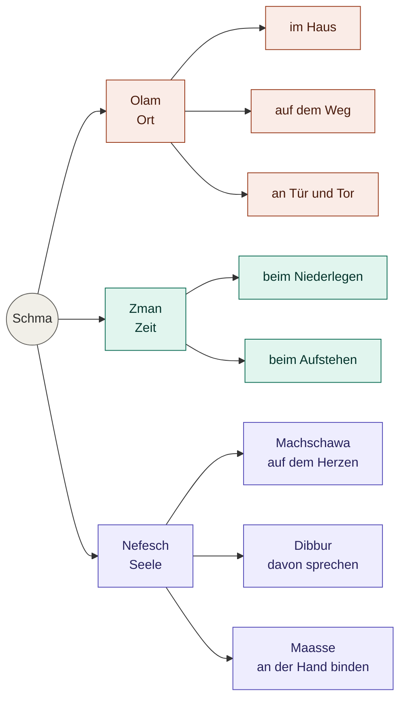

*Zu diesem Beitrag: Gedanken zur Allgegenwart der Tora und der Konzentration (Kavana) während des Kriat Schma. Mit Bezug auf [Lekutej Amarim, Kapitel 4](https://de.chabad.org/library/article_cdo/aid/583090/jewish/Kapitel-4.htm).*

---

Es gibt die Vorstellung, man könne das Leben in Schubladen packen. Hier die Arbeit. Dort die Familie. Hier der Urlaub. Dort die Religion.

Es gibt sogar den Witz von dem überfrommen Mann mit den sieben Gebissen: Eins für Fleischig, eins für Milchig, eins für Pessach-Fleischig… und eins für den Urlaub, wo er es mit den Regeln nicht so genau nimmt.

Das ist der Versuch einer Trennung. Ein „Urlaub vom Judentum".

Aber das Judentum ist keine Abteilung im Kaufhaus des Lebens. Es ist das Gebäude selbst. Es mischt sich ein. 24 Stunden am Tag. 7 Tage die Woche. 365 Tage im Jahr.

Das ist es, was wir im *Schma Jisrael* jeden Tag zweimal aussprechen. Genau hier liegt das Geheimnis der Konzentration.

---

## Die Worte, die alles fordern

Wir lesen im Schma die Anweisung: *„Und du sollst den Ewigen, deinen G-tt, lieben…"* Wann? Wo? Wie?

Die Antwort folgt sofort: *„Wenn du in deinem Haus sitzt, und wenn du auf dem Weg gehst, wenn du dich niederlegst und wenn du aufstehst."*

In Gedanken. Im Sprechen. Im Tun. Zu Hause. Unterwegs. Beim Einschlafen. Beim Aufwachen.

Das Schma lässt keine Lücken. Es lässt keinen Raum für ein „Hier bin ich Mensch, hier darf ich's sein – und in der Synagoge bin ich Jude". Es erhebt Anspruch auf die Totalität.

---

## Warum unsere Gedanken wandern

Wir kämpfen mit der Kavana, der Konzentration, weil wir das Gebet als Flucht aus dem Alltag missverstehen.

Wir schließen die Augen. Wir halten die Hand vors Gesicht. Wir versuchen, die Welt auszusperren – das Geschäft, die Reise, die Probleme im Haus.

Aber das Gehirn schaltet nicht ab. Die Gedanken drängen. Der Kontostand. Der Weg zur Arbeit. Das Gespräch von gestern.

Wir ärgern uns. Wir denken: *Ich bin abgelenkt. Ich habe keine Kavana.*

---

## Die Welt in das Gebet holen

Was wäre, wenn wir die Strategie ändern?

Das Schma sagt uns nicht, das Haus zu vergessen. Es sagt uns, G-ttes Einheit *in das Haus* hineinzutragen.

Kommt der Gedanke an dein Haus – bete: *„Wenn du in deinem Haus sitzt."* G-tt ist auch im Wohnzimmer.

Kommt die Sorge um die morgige Fahrt – bete: *„Wenn du auf dem Weg gehst."* G-tt sitzt mit im Auto.

Die höchste Konzentration ist nicht das Ausblenden der Realität. Sie ist die Unterwerfung der Realität unter eine einzige Wahrheit: *G-tt ist Eines.*

---

## Olam, Zman, Nefesch

Die Kabbala kennt drei Achsen der Wirklichkeit. Raum. Zeit. Seele. *Olam. Zman. Nefesch.*

Das Schma trifft alle drei.

Der Raum: dein Haus, dein Weg, deine Tür, dein Tor.
Die Zeit: dein Niederlegen, dein Aufstehen.
Die Seele: dein Herz, dein Mund, deine Hand.

Gedanke. Wort. Tat. *Machschawa. Dibbur. Maasse.* Die drei Gewänder, durch die die Seele in die Welt tritt.

Nichts bleibt außen vor.

Drei Achsen. Eine Quelle. Kein Punkt der Existenz fällt heraus.

---

## Religion vs. Leben

Es gibt die Geschichte von einem Rabbiner in einer sehr modernen Gemeinde. Er wollte am Schabbat über die Schabbat-Ruhe sprechen. Der Gemeindevorsteher warnte ihn: „Tu das nicht. Die Leute fahren mit dem Auto zur Synagoge."

Der Rabbiner wollte über koscheres Essen sprechen. „Tu das nicht. Sie essen nicht koscher."

„Worüber soll ich dann sprechen?", fragte der Rabbiner verzweifelt.

Der Vorsteher antwortete: „Sprich über Judentum!"

Für diesen Vorsteher waren das Leben und das Judentum zwei verschiedene Dinge. Das Auto hier. Der Glaube dort.

Aber abstrakte Ideen haben keine Kraft. Sie verändern uns nicht.

---

## Der Fokus

Echte Kavana entsteht nicht durch das Ausschalten des Lebens. Sie entsteht, wenn Gedanke, Wort und Tat im selben Augenblick auf dasselbe zeigen. *Machschawa. Dibbur. Maasse.* Drei Gewänder. Ein Träger.

Wenn wir die Augen schließen, schließen wir nicht die Welt aus. Wir sehen sie klar: ein einziger, ungeteilter Ort. Eine Aufgabe.

Ohne Pause. Ohne Urlaub. Mit völliger Klarheit.
