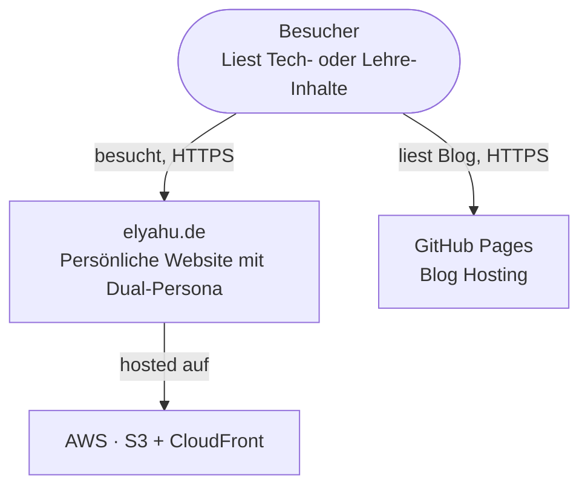
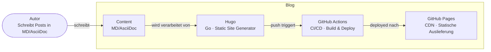

## Warum C4?

Das C4-Modell von Simon Brown strukturiert Architekturdiagramme in vier Abstraktionsebenen:

1. **Context** — System und seine Umgebung
2. **Container** — Technische Bausteine
3. **Component** — Interne Struktur eines Containers
4. **Code** — Klassenebene (selten nötig)

## Context Diagram: elyahu.de

## Container Diagram: Blog

## Einbettung in Hugo

Die Diagramme werden als Mermaid-Codeblöcke eingebettet und rendern client-seitig im Browser — kein externer Server, kein Netzwerkaufruf beim Build.
