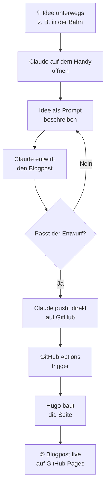

## Die Situation

Es ist Sonntagabend. Ich sitze in der Bahn, ohne Laptop. Mir fällt plötzlich etwas ein, das ich unbedingt aufschreiben möchte — eine Idee, ein Lernmoment, eine Beobachtung. Früher hätte ich das in eine Notiz-App getippt und es später (oft: nie) zu einem Post ausgebaut.

Heute funktioniert das anders.

## Der Workflow

Kein Laptop. Kein Terminal. Kein manuelles Deployment.

## Was hier wirklich passiert

Der entscheidende Punkt: Claude ist nicht nur ein Schreibassistent — er hat Zugriff auf das Repository und kann direkt committen und pushen. Der Workflow ist deshalb nicht:

> Idee → Text schreiben → copy-paste → git push

Sondern:

> Idee beschreiben → fertig.

GitHub Actions übernimmt den Rest: Hugo baut die statische Seite, GitHub Pages stellt sie bereit. Das dauert unter einer Minute.

## Das Werkzeug richtig einsetzen

Ein paar Dinge, die ich dabei gelernt habe:

**Kontext mitgeben zahlt sich aus.** Statt „Schreib einen Blogpost über X" funktioniert „Schreib einen Blogpost für meinen Hugo-Blog im gleichen Stil wie die anderen Posts — kurz, direkt, auf Deutsch, mit einem Mermaid-Diagramm" deutlich besser.

**Claude kennt das Repo.** Weil Claude Zugriff auf die bestehenden Dateien hat, kann er Frontmatter-Format, Sprache und Tonalität aus vorhandenen Posts ableiten. Das spart Erklärungsarbeit.

**Der Mensch bleibt am Steuer.** Ich gebe die Idee vor, ich entscheide ob der Entwurf passt, ich sage wann gepusht wird. Claude ist das Werkzeug — nicht der Autor.

## Warum das interessant ist

Nicht weil KI schreibt. Sondern weil die Hürde zwischen Gedanke und veröffentlichtem Post gegen null geht.

Wer je einen Entwurf in einer Notiz-App gehabt hat, der dann vier Wochen dort lag, bis die Motivation weg war — der versteht, warum das zählt.

Das hier ist kein Automatisierungs-Hype. Es ist ein konkreter Workflow, der ein echtes Reibungsproblem löst.

## Fazit

Mobil denken, mobil publizieren. Der Laptop bleibt zu.
