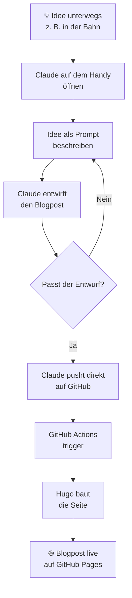

## Die Situation

Es ist Sonntagabend. Ich sitze in der Bahn, ohne Laptop. Mir fällt plötzlich etwas ein, das ich unbedingt aufschreiben möchte — eine Idee, ein Lernmoment, eine Beobachtung. Früher hätte ich das in eine Notiz-App getippt und es später (oft: nie) zu einem Post ausgebaut.

Heute funktioniert das anders.

## Der Workflow


```mermaid
flowchart TD
    A[💡 Idee unterwegs\nz. B. in der Bahn] --> B[Claude auf dem Handy\nöffnen]
    B --> C[Idee als Prompt\nbeschreiben]
    C --> D[Claude entwirft\nden Blogpost]
    D --> E{Passt der Entwurf?}
    E -- Nein --> C
    E -- Ja --> F[Claude pusht direkt\nauf GitHub]
    F --> G[GitHub Actions\ntrigger]
    G --> H[Hugo baut\ndie Seite]
    H --> I[🌐 Blogpost live\nauf GitHub Pages]
```

Kein Laptop. Kein Terminal. Kein manuelles Deployment.

## Was hier wirklich passiert

Der entscheidende Punkt: Claude ist nicht nur ein Schreibassistent — er hat Zugriff auf das Repository und kann direkt committen und pushen. Der Workflow ist deshalb nicht:

> Idee → Text schreiben → copy-paste → git push

Sondern:

> Idee beschreiben → fertig.

GitHub Actions übernimmt den Rest: Hugo baut die statische Seite, GitHub Pages stellt sie bereit. Das dauert unter einer Minute.

## Das Werkzeug richtig einsetzen

Ein paar Dinge, die ich dabei gelernt habe:

**Kontext mitgeben zahlt sich aus.** Statt „Schreib einen Blogpost über X" funktioniert „Schreib einen Blogpost für meinen Hugo-Blog im gleichen Stil wie die anderen Posts — kurz, direkt, auf Deutsch, mit einem Mermaid-Diagramm" deutlich besser.

**Claude kennt das Repo.** Weil Claude Zugriff auf die bestehenden Dateien hat, kann er Frontmatter-Format, Sprache und Tonalität aus vorhandenen Posts ableiten. Das spart Erklärungsarbeit.

**Der Mensch bleibt am Steuer.** Ich gebe die Idee vor, ich entscheide ob der Entwurf passt, ich sage wann gepusht wird. Claude ist das Werkzeug — nicht der Autor.

## Der genaue Prompt & Prompt-Engineering

Hier ist der genaue Prompt, den ich auf dem Handy nutze, um Claude anzuweisen, einen Post im passenden Format zu schreiben und ins Repository einzupflegen:

<details>
  <summary>Prompt-Vorlage anzeigen</summary>

  ```markdown
  Ich habe eine Idee für einen neuen Tech-Post:
  "[Hier die Idee stichpunktartig einfügen]"

  Bitte verfasse diesen Post im Markdown-Format. Beachte dabei folgende Regeln:
  1. Verwende das exakt gleiche Frontmatter-Format wie in content/tech/*.md (title, date, description, tags, categories: ["tech"], personas: ["tech"]).
  2. Schreibe kurz, direkt, auf Deutsch.
  3. Nutze ein passendes Mermaid-Diagramm zur Visualisierung, falls es den Inhalt unterstützt.
  4. Erstelle die Datei im Pfad content/tech/[kebab-case-title].md.
  5. Zeige mir zuerst den Entwurf zur Freigabe. Nach meiner Freigabe schreibst du die Datei direkt ins Repository.
  ```
</details>

## Metriken & Kosten-Breakdown

Um den Workflow zu bewerten, habe ich die Kosten und Laufzeiten für einen typischen Post gemessen:

*   **Modell**: `claude-3-5-sonnet` (über Claude-Code oder die Web-Oberfläche mit Git-Integration)
*   **Token-Volumen**: ~4.500 Input-Tokens (inklusive Workspace-Kontext/historischen Posts), ~800 Output-Tokens.
*   **Kosten pro Post**: ca. $0,0255 USD (basierend auf API-Preisen von $3/MTok Input und $15/MTok Output).
*   **Latenzen**:
    *   **Generierung & Entwurf**: ~12-15 Sekunden
    *   **Push & GitHub Actions Build**: ~42 Sekunden
    *   **Gesamte Pipeline**: unter 1 Minute, bis der Post live erreichbar ist.

## Warum das interessant ist

Nicht weil KI schreibt. Sondern weil die Hürde zwischen Gedanke und veröffentlichtem Post gegen null geht.

Wer je einen Entwurf in einer Notiz-App gehabt hat, der dann vier Wochen dort lag, bis die Motivation weg war — der versteht, warum das zählt.

Das hier ist kein Automatisierungs-Hype. Es ist ein konkreter Workflow, der ein echtes Reibungsproblem löst.

## Fazit

Mobil denken, mobil publizieren. Der Laptop bleibt zu.
